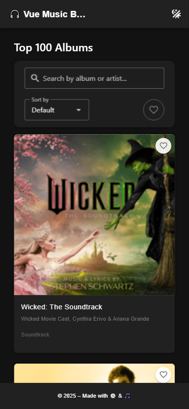

# 🎵 Top 100 Albums – Vue + Ts + Vite + Vuetify App

A modern, responsive music discovery app that fetches the **Top 100 Albums** from iTunes using their public API. Built with **Vue 3**, **TypeScript**, **Vite**, and **Vuetify** for sleek UI, this app offers smooth UX, filtering, sorting, and offline capabilities via **PWA**.

---

## 😎 DEMO

[Click for DEMO](https://MarkFicht.github.io/top-100-albums/)

---

## ✨ Features

### 🔍 Search

- Debounced search with validation
- Real-time filtering by album or artist
- Accessible input with ESC key & clear button
- Automatically handles invalid characters

### 🔃 Sorting & Filtering

- Sort albums by:
  - Title (A-Z)
  - Artist (A-Z)
  - Genre (A-Z)
  - Favorites First
- Toggle to view only favorite albums

### ❤️ Favorites

- Save/remove albums as favorites
- Persisted in `localStorage`
- Favorites are visually marked with heart icons

### 🎷 Album Details

- Route to detailed view `/album/:id`
- Displays:
  - Name, artist, release date, genre, price, copyright
  - Cover image
  - Apple Music link
  - Audio preview (fetched live from iTunes Search API)
- In-app `<audio>` player with fallback error handling

### 🧱 Navigation & Routing

- Vue Router setup with:
  - Home `/`
  - Album detail `/album/:id`
  - 404 Not Found for unmatched routes
- Custom 404 page with fun styling and recovery button

### 📱 Mobile-First Responsive Design

- Fully responsive grid and layouts (Vuetify’s grid system)
- Optimized for iPhones and other mobile devices
- Sticky filter/search bar on scroll
- Tap-targets optimized for touch screens (48x48px minimum)

### 🌙 Dark Mode

- Full Vuetify dark/light theme support
- Adaptive UI elements (hearts, buttons, backgrounds, icons)

### 📦 PWA Support

- Installable app on mobile/desktop
- Works offline after first visit
- Includes:
  - Manifest
  - Custom favicon / og-image
  - Service Worker via `vite-plugin-pwa`

---

## 🧪 Testing

### ✅ Unit Tests

- Framework: **Vitest**
- Tested Composables:
  - `useSearchAlbums.ts` – debounce, sanitization, fetch logic
- Tested Components:
  - `AlbumCard.vue` – renders info, emits events, routing
  - `NotFound.vue` – error state rendering

### ✅ E2E Tests

- Framework: **Cypress**
- Covers:
  - Search and navigation to album detail
  - Handling of empty/no results state
  - Sorting behavior by title
  - 404 page redirection and return

---

## 🛠️ Tech Stack

| Layer         | Tech                     |
| ------------- | ------------------------ |
| Frontend      | Vue 3 + Composition API  |
| UI Framework  | Vuetify 3                |
| Build Tool    | Vite                     |
| Type Checking | TypeScript               |
| Testing       | Vitest + @vue/test-utils |
| E2E           | Cypress                  |
| PWA           | vite-plugin-pwa          |

---

## 🚀 Getting Started

```bash
# Install dependencies
npm install

# Start development
npm run dev

# Run unit tests
npm run test:unit

# Run E2E tests
npm run test:e2e

# Build for production
npm run build
```

---

## 📁 Project Structure (Simplified)

```
src/
├─ components/
│  └─ AppLayout.vue
│  └─ AlbumCard.vue
│  └─ __tests__/AlbumCard.spec.ts
├─ views/
│  └─ HomeView.vue
│  └─ AlbumDetails.vue
│  └─ NotFound.vue
│  └─ __tests__/NotFound.spec.ts
├─ composables/
│  └─ useAlbums.ts
│  └─ useFavorites.ts
│  └─ useSortedAlbums.ts
│  └─ useSearchAlbums.ts
│  └─ __tests__/useSearchAlbums.spec.ts
├─ types/
│  └─ Album.ts
├─ utils/
│  └─ safePares.ts
├─ router/
│  └─ index.ts
cypress/
  └─ e2e/
      └─ favorites.cy.ts
      └─ search.cy.ts
      └─ sort.cy.ts
      └─ not-found.cy.ts
      └─ validation.cy.ts
```

---

## 🙌 Credits

- Inspired by Apple's iTunes Top Albums RSS feed
- Designed with accessibility and mobile-first in mind
- Icons by [Material Design Icons](https://materialdesignicons.com/) & Flaticon

---

## 🧠 TODO Ideas (if continued)

- Add pagination or infinite scroll
- Better offline fallback UI
- Improve audio preview experience (pause/play toggle)
- Add album review / rating feature
- Add missing test (unit and e2e)

---

## 📸 Preview



---

## 🧠 Summary

This project showcases a polished frontend architecture with good UX, dark/light support, PWA capabilities, and a fully tested flow from search to previewing albums. Great foundation for any Vue + Vuetify project.

---

> Built with ❤️ & 🎷 by **Marek Ficht**
